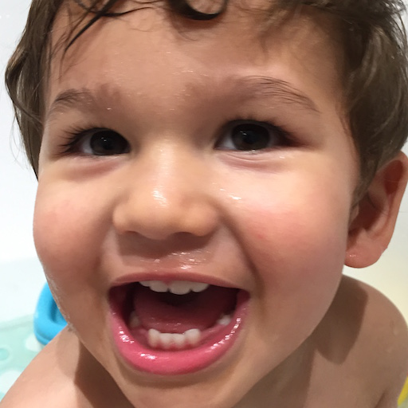
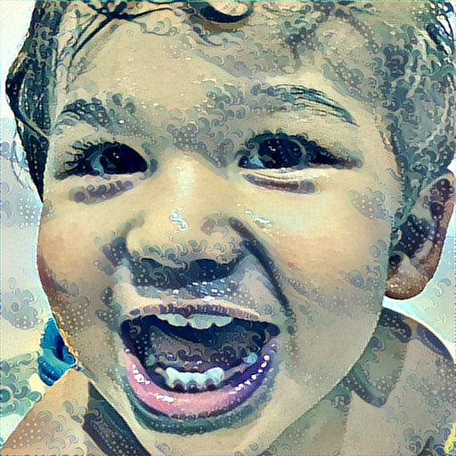

# Artistic Style Transfer
***This repository contains the code for Style Transfer from an Art to an Input Image using Keras and Tensorflow.***

All code is written in Python 3 using PyCharm IDE.

# Requirements
1. **Tensorflow**
2. **Keras**
3. **Numpy**
4. **Scipy**

# Results

* Content Image                                 +                      Style Image            =       Style Transferred Image 

  

  

**Update:** ***Code tested on Windows 64-bit, Ubuntu 16.04 and Google Cloud Server Instance (Ubuntu 16.04, 7.50GB RAM)***

# Resources

| S.No.  |                       Papers / Authors                    |                     Paper Links                      |
| ------ | --------------------------------------------------------- | ---------------------------------------------------- |
|1.      | "A Neural Algorithm of Artistic Style" by Leon A. Gatys   |         https://arxiv.org/pdf/1508.06576.pdf         |
|2.      | "Very Deep Convolutional Neural Networks For Large Scale Image Recognition" by Karen Simonyan & Andrew Zisserman|https://arxiv.org/pdf/1409.1556.pdf |
|3.      | "Perceptual Losses for Real-Time Style Transfer and Super-Resolution" by Justin Johnson|https://arxiv.org/pdf/1603.08155.pdf|
|4.      | "Incorporating Long-Range Consistency in CNN-Based Texture Generation" by Guillaume Berger & Roland Memisevic|https://arxiv.org/pdf/1606.01286.pdf|
|5.      |Convolutional neural networks for artistic style transfer by Harish Narayanan|https://harishnarayanan.org/writing/artistic-style-transfer/|
